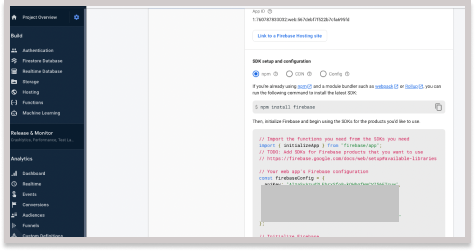

# Fitness Tracker Class Exercise

This is a little fitness tracking application that we are making as part of a, third year, contemporary web application module.

## Get Started

> > You need to get the firebase config object from your project settings. Ensure that you have a firebase account, and have set up a new project and an application within this project.

1. Rename `src/config/firebase.example.config.js` to `src/config/firebase.js`
2. Update the `src/config/firebase.example.config.js` to contain the config object from your project
3. Ensure that you've enabled some authentication methods from your firebase console (e.g, Email, Gmail, and Facebook)
4. You can now run the application `npm run start`